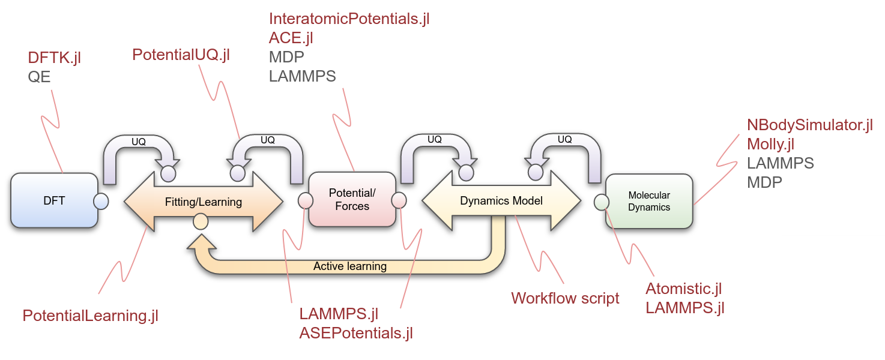

# [WIP] Atomistic Composable Workflows

The Center for the Exascale Simulation of Materials in Extreme Environments ([CESMIX](https://computing.mit.edu/cesmix/)) is a new MIT research effort to advance the state-of-the-art in predictive simulation. It seeks to connect quantum and molecular simulations of materials with state-of-the-art programming languages, compiler technologies, and software performance engineering tools, underpinned by rigorous approaches to statistical inference and uncertainty quantification.

This repository aims to gather easy-to-use CESMIX-aligned case studies, integrating the latest developments of the Julia atomistic ecosystem with state-of-the-art tools. This is a work in progress and is not ready for production, however some of our examples can already be used.

## Atomistic composable workflows

A series of composable workflows is guiding our design and development. We analyzed three of the most representative workflows: classical MD, Ab initio MD, and classical MD with active learning. 


- CW1 describes  the  software  components  and  relationships  of  a  classical  MD  simulation. Essentially, at each time step, the force associated with each atom is calculated based on the interatomic potential, and then used to calculate each new atomic position.
The correct functioning of the calculators is analyzed and reported, via the curved arrow components to the dynamics model or control component.  E.g. a UQ analysis is performed on the force and MD calculations so that the control module can take corrective action.  
In addition, a composable design must guarantee the communication of all the processes, for this purpose  "wrapper"  components,  represented  by  small circles in the figure, are included in the design. The wrappers are key in this design because they allow  heterogeneous  software  to  coexist  in  the  same workflow.  Each wrapper implements a set of interfaces associated  with a  particular  component. 
- CW2 depicts an Ab initio MD process.  It is mostly analogous  to  the  workflow described above,  but  in this  case  the  force  calculation  is  provided  by  a  DFT simulation.
- CW3 presents a combination of the latter workflows.  Here, potentials/forces are fitted with respect  to  the  data  generated  by  the  DFT  simulator. The fitting process is complex and therefore requires a dedicated software component, as well as analysis of its inputs in terms of error, sensitivity, etc.  Furthermore,  the  dynamics model component,  based  on the analysis of the potential, forces and molecular dynamics,  can  re-fit these  forces  in  a  process called active learning.

## Atomistic suite for CESMIX in Julia

This composable approach allowed us to characterize each software component involved, which can be associated with one or more atomistic tools, as well as their interactions with other components. In particular, an increasing number of Julia packages dedicated to atomistic simulations are currently being developed. These packages combine the dynamic and interactive nature of Julia with its high-performance capabilities.




- [AtomsBase.jl](https://github.com/JuliaMolSim/AtomsBase.jl) is a lightweight abstract interface for representation of atomic geometries. It helps in the operability of diverse atomistic tools. Furthermore, [AtomIO.jl](https://github.com/mfherbst/AtomIO.jl) is a standard IO package for atomic structures integrating with FileIO, AtomsBase, and others.
- [DFTK.jl](https://docs.dftk.org/stable/), the density-functional toolkit, is a library for playing with plane-wave density-functional theory (DFT) algorithms. In its basic formulation it solves periodic Kohn-Sham equations.
- [InteratomicPotentials.jl](https://github.com/cesmix-mit/InteratomicPotentials.jl) and [InteratomicBasisPotentials.jl](https://github.com/cesmix-mit/InteratomicBasisPotentials.jl) are responsible for providing the methods to calculate the energies, forces and virial tensors of the potentials that we use in CESMIX.
- [PotentialLearning.jl](https://github.com/cesmix-mit/PotentialLearning.jl) aims to facilitate the learning/fitting of interatomic potentials and forces, ensuring fast execution, leveraging state-of-the-art tools. The code of this tool will be refactored in the near future.
- [Atomistic.jl](https://github.com/cesmix-mit/Atomistic.jl) provides an integrated workflow for MD simulations.
- [LAMMPS.jl](https://github.com/cesmix-mit/LAMMPS.jl) provides the bindings to the LAMMPS API, allowing other modules to access interatomic potentials, such as SNAP.


## Case studies

Listed here is a subset of the case studies we are developing. We are gradually adding new cases as well as improving and increasing the complexity of the current ones.

| CW |            Type           |        DFT       | UQ | Fitting/ Learning |               Potential / Forces               |    Molecular Dynamics   | Location          |
|:--:|:-------------------------:|:----------------:|:--:|:-----------------:|:----------------------------------------------:|:-----------------------:|-------------------|
| 1  | Ar                        |                  |  ✓ |         ✓         | InteratomicPotentials.jl → Lennard Jones / ACE | LAMMPS.jl → LAMMPS      | Current repo      |
| 1  | Ar                        |                  |  ✓ |         ✓         | InteratomicPotentials.jl → LennardJones / ACE  | Atomistic.jl → Molly.jl | Current repo      |
| 1  | Ar                        |                  |    |                   | InteratomicPotentials.jl → LennardJones        | Atomistic.jl → Molly.jl | [Atomistic.jl repo](https://github.com/cesmix-mit/Atomistic.jl/blob/main/examples/argon/molly_lj_simulation.jl) |
| 1  | Na                        |                  |    |                   | LAMMPS.jl → EAM                                | LAMMPS.jl  → LAMMPS     | Current repo      |
| 3  | Na                        | DFTK.jl          |  ✓ |         ✓         | InteratomicPotentials.jl  → SNAP / ACE         | LAMMPS.jl  → LAMMPS     | Current repo      |
| 3  | HfO2 , a-HfO2, TiO2, etc. | Multiple sources |    |         ✓         | InteratomicPotentials.jl → ACE                 | Atomistic.jl → Molly.jl | Current repo      |

Atomistic.jl also provides abstractions for using NBodySimulator.jl, however we are currently focusing on Molly.jl, which provides more flexibility.

Examples of use can be found on the websites or github repositories of each tool mentioned.


## Example: Fit different DFT datasets using ACE, run multiple serial/parallel fitting experiments, and run an MD simulation.

In the folder `ACE`, you will find a basic integrated example that allows you to fit DFT datasets with ACE and run an MD simulation.

### Chose a DFT dataset

Choose a DFT dataset. Currently, this code accepts either two `xyz` files, one for training and one for testing, or a single `xyz` file, which is automatically split into training and testing. Example datasets can be downloaded from the following urls.

- a-HfO2 dataset: "Machine-learned interatomic potentials by active learning:
 amorphous and liquid hafnium dioxide". Ganesh Sivaraman,
 Anand Narayanan Krishnamoorthy, Matthias Baur, Christian Holm,
 Marius Stan, Gábor Csányi, Chris Benmore & Álvaro Vázquez-Mayagoitia.
 DOI: 10.1038/s41524-020-00367-7.
 [Dataset url](https://github.com/argonne-lcf/active-learning-md/tree/master/data)
- FitSNAP: A Python Package For Training SNAP Interatomic Potentials for use in the LAMMPS molecular dynamics package. [Datasets url](https://github.com/FitSNAP/FitSNAP/tree/master/examples)
- CESMIX training data repository. [Datasets url](https://github.com/cesmix-mit/TrainingData)


### Fit ACE

The input parameters are listed below:

| Input parameter      | Description                                               | E.g.                |
|----------------------|-----------------------------------------------------------|---------------------|
| experiment_path      | Experiment path                                           | TiO2/               |
| dataset_path         | Dataset path                                              | data/               |
| trainingset_filename | Training datasets filename                                | TiO2trainingset.xyz |
| testset_filename     | Test datasets filename                                    | TiO2testset.xyz     |
| n_train_sys          | No. of atomic configurations in training dataset          | 80                  |
| n_test_sys           | No. of atomic configurations in test dataset              | 20                  |
| n_body               | Body order                                                | 3                   |
| max_deg              | Maximum polynomial degree                                 | 3                   |
| r0                   | An estimate on the nearest-neighbour distance for scaling | 1.0                 |
| rcutoff              | Outer cutoff radius                                       | 5.0                 |
| wL                   | See run-experiments.jl                                    | 1.0                 |
| csp                  | See run-experiments.jl                                    | 1.0                 |
| w_e                  | Energy weight                                             | 1.0                 |
| w_f                  | Force weight                                              | 1.0                 |

Run fitting process

```
$ julia fit-ace.jl  experiment_path         TiO2/ \
                    dataset_path            data/ \
                    trainingset_filename    TiO2trainingset.xyz \
                    testset_filename        TiO2testset.xyz \
                    n_train_sys             80 \
                    n_test_sys              20 \
                    n_body                  3 \
                    max_deg                 3 \
                    r0                      1.0 \
                    rcutoff                 5.0 \
                    wL                      1.0 \
                    csp                     1.0 \
                    w_e                     1.0 \
                    w_f                     1.0
```

In addition, you can run the experiments with the default parameters (the parameters shown above).

```bash
$ julia fit-ace.jl
```


### Run multiple fitting experiments in serial/parallel using the wrapper to ACE1.jl in InteratomicBasisPotentials.jl

Modify the file `run-experiments.jl` to specify the parameter ranges needed to generate the experiments. E.g.
```julia
# Parallel execution. Warning: a high number of parallel experiments may degrade system performance.
parallel = true

# n_body: body order. N: correlation order (N = n_body - 1)
n_body = 2:5

# max_deg: maximum polynomial degree
max_deg = 3:6
```

Run the script:

```bash
$ julia run-experiments.jl
```

Each experiment is run in a separate process (using `nohup` to facilitate its execution in a cluster).
The results are stored in the folder `experiments/`.
After all experiments have been completed, run the following script to gather the results into a single csv.

```shell
$ ./gather-results.sh
```

### Run an MD simulation using the wrapper to Molly.jl or NBodySimulator.jl in Atomistic.jl

```bash
$ run-md-ahfo2-ace-nbs.jl
```
or
```bash
$ run-md-ahfo2-ace-molly.jl
```
(Note: currently there is a bug in the second script) 


## Installation

#### Install Julia on Ubuntu

1.  Open terminal and download Julia from https://julialang.org/downloads/
    ```bash
    $ wget https://julialang-s3.julialang.org/bin/linux/x64/1.7/julia-1.7.3-linux-x86_64.tar.gz
    ```
2.  Extract file
    ```bash
    $ tar xvzf julia-1.7.3-linux-x86_64.tar.gz
    ```
3. Copy to `/opt` and create link
    ```bash
    $ sudo mv  ./julia-1.7.3 /opt/
    $ sudo ln -s /opt/julia-1.7.3/bin/julia /usr/local/bin/julia
    ```
4. Alternative: add line to `.bashrc`
    ```bash
    $ nano .bashrc
    PATH=$PATH:/home/youruser/julia-1.7.3 /bin/
    ```
5. Restart the terminal

#### Add registries and install dependencies

1. Open a Julia REPL
    ```bash
    $ julia
    ```
2. Add registries: General, CESMIX, and MolSim
    ```bash
    pkg> registry add https://github.com/JuliaRegistries/General
    pkg> registry add https://github.com/cesmix-mit/CESMIX.git 
    pkg> registry add https://github.com/JuliaMolSim/MolSim.git
    ```
3. Install general packages your workflow is likely to require. E.g.
    ```bash
    pkg> add LinearAlgebra
    pkg> add StaticArrays
    pkg> add UnitfulAtomic
    pkg> add Unitful
    pkg> add Flux
    pkg> add Optimization
    pkg> add OptimizationOptimJL
    pkg> add BenchmarkTools
    pkg> add Plots
    ```
4. Install CESMIX packages
    ```bash
    pkg> add AtomsBase
    pkg> add InteratomicPotentials
    pkg> add InteratomicBasisPotentials
    pkg> add https://github.com/cesmix-mit/PotentialLearning.jl
    pkg> add Atomistic
    ```
5. Install other important dependencies
    - MD simulators
    ```
    pkg> add Molly
    pkg> add NBodySimulator
    ```
    - ACE (see: https://acesuit.github.io/ACE.jl/dev/gettingstarted/#Installation)
    ```bash
    pkg> add PyCall IJulia
    pkg> add ACE
    pkg> add JuLIP ASE ACEatoms
    pkg> add IPFitting
    ```

